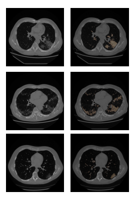

| **Authors**  | **Project** |  **Build Status** | **License** | **Code Quality** | **Coverage** |
|:------------:|:-----------:|:-----------------:|:-----------:|:----------------:|:------------:|
| [**R. Biondi**](https://github.com/RiccardoBiondi) <br/> [**N. Curti**](https://github.com/Nico-Curti) | **COVID-19 Lung Segmentation** | **Linux/MacOS** : **TODO** <br/>  **Windows** : [](https://ci.appveyor.com/project/RiccardoBiondi/segmentation) | [](https://github.com/RiccardoBiondi/segmentation/blob/master/LICENSE.md) | **Codacy** : [](https://www.codacy.com/manual/RiccardoBiondi/segmentation?utm_source=github.com&amp;utm_medium=referral&amp;utm_content=RiccardoBiondi/segmentation&amp;utm_campaign=Badge_Grade) <br/> **Codebeat** : [](https://codebeat.co/projects/github-com-riccardobiondi-segmentation-master) | []() |


[](https://github.com/RiccardoBiondi/segmentation/pulls)
[](https://github.com/RiccardoBiondi/segmentation/issues)

[](https://github.com/RiccardoBiondi/segmentation/stargazers)
[](https://github.com/RiccardoBiondi/segmentation/watchers)

# COVID-19 Lung Segmentation

The project is developed in order to provide an fast and easy to use way to extract lung and identify ground glass lesions on TAC images. The program consist in a series of scripts to pre-process and cluster the stack of lung images. This program allows to isolate body an lung regions, reduce the background by selecting a ROI and to segment the ground glass lesions by using the colour quantization

1. [Overview](#Overview)
2. [Contents](#Contents)
3. [Prerequisites](#prerequisites)
4. [Getting Started](#Getting Started)
5. [Usage](#usage)
6. [License](#license)
7. [Contribution](#contribution)
8. [Authors](#authors)
9. [Acknowledgments](#acknowledgments)
10. [Citation](#citation)

## Overview
SARS-CoV-2  virus has widely spread all over the world since the beginning of 2020. It is really useful and desiderable to find a way to identify the lesion of COVID-19 in lung regions by using CAT images.
The approach proposed in this project involves the usage of  colour quantization to identify the ground glass regions inside lung. To perform this technique we have used the k-means clustering algorithm.
To achieve this purpose the presented approach will use an algorithm to isolate the lung regions.

The segmentation of lung regions involves three steps:
- Preprocessing: Involves lung, ROI and slice selection
- Training: this process will estimate the centroids for the clusters
- Labeling: In which the centroids estimated by using the train dataset are used to segment the TAC images


**Example of segmentation**. **Left:** Original image: **Right** original image with identified ground glass areas.


<!--
  <html>
    <head>
  	<style>
  	figure {
  		border: thin #c0c0c0 solid;
      display: flex;
      flex-flow: column;
      padding: 5px;
  		max-width: 400px;
      max-height: 755px
  	}

  	figcaption {
  		background-color: black;
      color: gray;
      font: italic smaller sans-serif;
      padding: 7px;
      text-align: center;
  	}
  </style>
  </head>
  <body>


  <figure>
  	
  	<figcaption>
  	Example of segmentation performed by the algorithm: left: original image; right: image
  	</figcaption>
  </figure>


</body>
</html>


Add images
-->

## Contents

The folder named [segmentation](#./docs/segmentation) contains two libraries : [utils](#./docs/segmentation/utils.md) and [method](#./docs/segmentation/method.md) which contains the implementation of functions to manage the input, the output and the operation used in the implemented scripts.

The [pipeline](#./docs/pipeline) folder contains a series of scripts to extract the lung, select only the ROI and the slices which contains the lung, compute the centroids and label the images.


| **Script name** | **Description** |
|---              |---              |
|[lung_extraction](./docs/pipeline/lung_extraction.md)   |  Extract lung from TAC images |
| [slice_and_ROI](./docs/pipeline/slice_and_ROI.md)  | Select the ROI and slices with lung  |
| [train](./docs/pipeline/train.md)  | Apply colour quantization on a series of stacks in order to estimate the centroid to use to segment other images  |
| [labeling](./docs/pipeline/labeling.md)  |  Segment the input image by using pre-estimated centroids |


In the end for each script described below there is a powershell script which allow to execute the script on multiple patient.


## Prerequisites

This script use opencv-python, numpy, pandas, functool and pickle, see [requirements](./requirements.txt) for more informations.
Please ensure that your python version support these libraries before use these scripts. Only *labeling* script use sklearn.clustering.KMeans, so if you have to run it, please ensure to have installed sklearn.

## Getting Started

First of all you have to install all the required python packages:

```
pip install -r requirements.txt
```

Now clone this repository in your working directory

```
C:\User\userName\your\working\directory> git clone https://github.com/RiccardoBiondi/segmentation.git
```


## Usage

First of all you have to divide the data in train and test dataset: the first one to estimate the centroids used to segment the second one. To achieve these purpose create two folders named *train* and *test* and organize your sample inside them. Notice that all the data must be into *.pkl.npy* format.

### Training
 - first of all you have to create the *output* folder, in which all the results will be saved, the format is *.pkl.npy*
 - Now you have to isolate the lung from the rest of the body. To do that simply run lung_extraction.ps1 by providing as arguments the input folder and the output one:
 ```
 C:\User\userName\your\working\directory\segmentation> & "./lung_extraction.ps1" path/to/input/folder path/to/output/folder
 ```

 - Once you have successfully isolated the lung, you have to remove all the regions and slices without lung, to achieve  this purpose simply run slice_and_ROI.ps1 by providing as arguments the input folder and the output one:
 ```
 C:\User\userName\your\working\directory\segmentation> & "./slice_and_ROI.ps1" path/to/input/folder/ path/to/output/folder/
 ```
 The input folder must contains the extracted lung, the output ones will store the stack resulting from the selection. Notice that if input and output are the same folder, the script will overwrite the input files.


- in the end you can start the training. Simply run train.ps1 by provinding as input folder the one that contains the results from the previous passages, and the output filename in which save the resulting centroids.
```
C:\User\userName\your\working\directory\segmentation> & "./slice_and_ROI.ps1" path/to/input/folder/ path/to/output/folder/centroids
```
This script will compute the centroids and save them into output folder as *centroids.pkl.npy*

<!---
Lets consider the segmentation of a stack of lung TAC images saved as `stack.pkl.npy` in `data` folder.
First of all you have to extract the lung region by calling `lung_extraction` script from powershell or bash.
```
python -m pipeline.lung_extraction --input='path/to/data/folder/stack.pkl.npy' --lung='path/to/data/folder/lung_extracted'
```
This will extract lungs for each slice of `stack.pkl.npy` and save it in `data` folder as `lung_extracted.pkl.npy`

Before applying the kmeans clustering we have to remove as much as possible of the background by selecting a ROI, which is the rectangular region with the smaller area that still contains the lungs.

```
python -m pipeline.slice_and_ROI --input='path/to/data/folder/lung_extracted.pkl.npy'
--output='path/to/data/folder/ROI'
```

To compute the ROI in the correct wat we have to provide as input the image with the extracted lung; the script will compute the ROI and save the coordinate of the upper left and bottom right corner of the region as `ROI.pkl.npy`.

Now we are able to perform the colour quantization by applying the kmeans clustering.
```
python -m pipeline.clustering --input='path/to/data/folder/lung_extracted.pkl.npy'
--ROI='path/to/data/folder/ROI.pkl.npy' --labels='path/to/data/folder/labels'
--centroid='path/to/data/folder/centroids' --n_clust=4
```

We have performed the colour quantization on the blurred image, by providing the *ROI* arguments we have clustered only the ROI. the arguments *--labels* and *--centroid* specify the path and the filename to save the labeled images and the computed centroids. last but not least *--n_clust* will specify the number of the clusters to consider.

Notice that each input file must be in `.pkl.npy` format; the output file will be in the same format.

Refers to [docs](./docs/index.md) for more information about each script.
-->

### Labeling
Once you have compute the centroids by using the training dataset, you can use them to label the test dataset. To achieve this purpose you have to use two folders: an input one, that in this case is the test one, and an output one, in which the results will saved.

-First of all you have to prepare the images by extraction the lung regions, so run the powershell script as before:
```
C:\User\userName\your\working\directory\segmentation> & "./lung_extraction.ps1" path/to/input/folder/ path/to/output/folder/
```

-once you have extracted the lung you can start to label the dataset. To achieve this purpose simply run the *labeling.ps1* script by providing the required parameters:
```
C:\User\userName\your\working\directory\segmentation> & "./labeling.ps1" path/to/input/folder/ path/to/output/folder/
path/to/centroids/file/centroids.pkl.npy
```
The input directory is the one that contains the images with the extracted lung. the output folder is the one in which the labeled images will be saved, notice that if is the same as input all the input data will be overwrite.

## License

The `COVID-19 Lung Segmentation` package is licensed under the MIT "Expat" License. [](LICENSE.md)

## Contribution

Any contribution is more than welcome `:heart:`. Just fill an [issue](https://github.com/RiccardoBiondi/segmentation/blob/master/ISSUE_TEMPLATE.md) or a [pull request](https://github.com/RiccardoBiondi/segmentation/blob/master/PULL_REQUEST_TEMPLATE.md) and we will check ASAP!

See [here](https://github.com/RiccardoBiondi/segmentation/blob/master/CONTRIBUTING.md) for further informations about how to contribute with this project.

## Authors

*  **Riccardo Biondi** [git](https://github.com/RiccardoBiondi)

*  **Nico Curti** [git](https://github.com/Nico-Curti), [unibo](https://www.unibo.it/sitoweb/nico.curti2)

*  **Enrico Giampieri** [git](https://github.com/EnricoGiampieri), [unibo](https://www.unibo.it/sitoweb/enrico.giampieri)

See also the list of [contributors](https://github.com/RiccardoBiondi/segmentation/contributors) [](https://github.com/RiccardoBiondi/segmentation/graphs/contributors/) who participated to this project.


### Citation

If you have found `COVID-19 Lung Segmentation` helpful in your research, please consider citing the project

```tex
@misc{COVID-19 Lung Segmentation,
  author = {Riccardo Biondi, Nico Curti, Enrico Giampieri, Gastone Castellani},
  title = {COVID-19 Lung Segmentation},
  year = {2020},
  publisher = {GitHub},
  howpublished = {\url{https://github.com/RiccardoBiondi/segmentation}},
}
```
