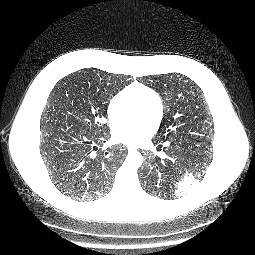
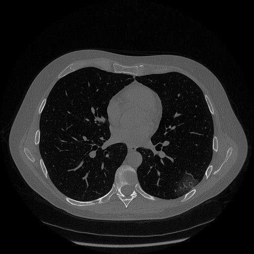
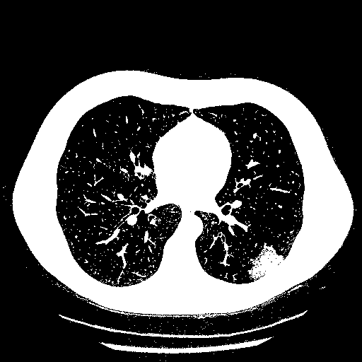
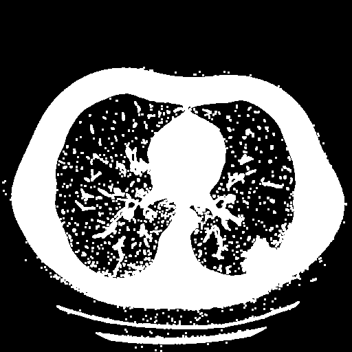
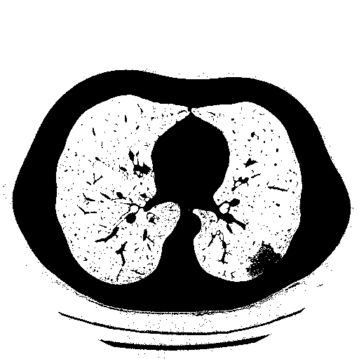
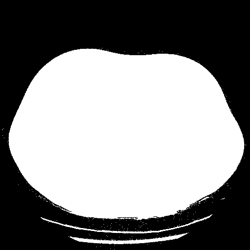

# Method

This module contains functions useful for the script execution. This functions allow to load and save pickle files, rescale image and extend some open-cv functions to a stack of images.

1. [load_pickle](#load_pickle)
2. [save_pickle](#save_pickle)
3. [rescale](#rescale)
4. [erode](#erode)
5. [dilate](#dilate)
6. [connectedComponentsWithStats](#connectedComponentsWithStats)
7. [to_dataframe](#to_dataframe)
8. [bitwise_not](#bitwise_not)
9. [imfill](#imfill)
10. [medianBlur](#medianBlur)


## load_pickle

This function load the '.pkl.npy' file that contains the image or the stack of images to process

**Parameter**

*filename*: str, file name or path to load file as pickle

**Return**

*data*: array like, numpy nd.array that contains the stack of images-

  ```python
    import cv2
    import numpy as np
    from segmentation.method import load_pickle

    stack = load_pikle('./images/image.pkl.npy')
    #
    #Processing
    #
  ```

## save_pickle

  Save in the processed stack of images '.pkl.npy' format. Data must be in a np.ndarray like format and the specified output file name doesn't requires to specify the extension.  

**Parameters**

  *filename*: str, file name or path to dump as pickle file

  *data*: array-like, image or stack to save
**Return** None

```python
  import cv2
  import numpy as np
  from segmentation.method import load_pickle, save_pickle

  stack = load_pikle('./images/image.pkl.npy')
  #
  #Stack processing
  #
  save_pickle('./output_dir/output_filename', stack)
```
## rescale
Rescale the image according to max, min input

**Parameters**

  *img* : array-like, input image or stack to rescale
  *max* : float, maximum value of the output array
  *min* : float, minimum value of the output array

  **Return**

  *rescaled* : array-like, image rescaled according to min, max

  ```python
    import cv2
    import numpy as np
    from segmentation.method import load_pickle, save_pickle
    from segmentation.method import rescale

    stack = load_pikle('./images/image.pkl.npy')
    stack[stack < 0] = 0
    rescaled = 255 * rescale(stack, stack.max(), 0)
    save_pickle('./output_dir/output_filename',  rescaled)
  ```


  <p style="text-align:center;">
    <caption>Original image</caption>
    
    <caption>Rescaled image</caption>

## erode
Compute the erosion for the whole stack of images. It is the extension for a stack of images of   `cv2.erode()`.

**Parameters**

*img* : array-like, image or stack of images to erode
*kernel* : (2D)array-like, kernel to apply to the input stack
*iterations* : int, number of iterations to apply, default 1

**Return**

*processed* : array-like, eroded stack

```python
  import cv2
  import numpy as np
  from segmentation.method import load_pickle, save_pickle
  from segmentation.method import rescale
  from segmentation.method import erode

  stack = load_pikle('./images/image.pkl.npy')
  stack[stack < 0] = 0
  stack = rescale(stack, stack.max(), 0)# apply a rescaling
  stack = 255 * np.where(stack > 0.1, 0, 1)#apply a threshold
  kernel = np.ones((3,3), dtype='uint8') #erosion kernel
  eroded = erode(stack, kernel, iterations=1)
  save_pickle('./output_dir/output_filename',  eroded)
```
<p style="text-align:center;">
  <caption>Thresholded image</caption>
  
  <caption>Eroded image</caption>

## dilate
Compute the dilation for the whole stack of images. It is the extension for a stack of images of   `cv2.dilate()`.

**Parameters**

*img* : array-like, image or stack of images to dilate
*kernel* : (2D)array-like, kernel to apply to the input stack
*iterations* : int, number of iterations to apply, default 1

**Return**

*processed* : array-like, dilated stack


```python
  import cv2
  import numpy as np
  from segmentation.method import load_pickle, save_pickle
  from segmentation.method import rescale
  from segmentation.method import dilate

  stack = load_pikle('./images/image.pkl.npy')
  stack[stack < 0] = 0
  stack = rescale(stack, stack.max(), 0)# apply a rescaling
  stack = 255 * np.where(stack > 0.1, 0, 1)#apply a threshold
  kernel = np.ones((3,3), dtype='uint8') #dilation kernel
  dilated = dilate(stack, kernel, iterations=1)
  save_pickle('./output_dir/output_filename',  dilated)
```
<p style="text-align:center;">
  <caption>Original image</caption>
  
  <caption>Dilated image</caption>

## connectedComponentsWithStats

computes the connected components labeled image of boolean image and also
produces a statistics output for each label. Is the extension for a stack of images of `cv2.connectedComponentsWithStats()` function.

**Parameters**

*img* : array-like, input image or stack of images

**Return**

*retval* : array-like

*labels* : array-like, labelled image or stack

*stats* : list of array-like, statistic for each label for each image of the stack

*centroids* : array-like, centroid for each label for each image of the stack


```python
  import cv2
  import numpy as np
  from segmentation.method import load_pickle
  from segmentation.method import connectedComponentsWithStats

  stack = load_pikle('./images/image.pkl.npy')
  stack= np.where(stack < 3, 0, 1) #apply a threshold to obtain boolean images
  ret, label, stats, centroids = connectedComponentsWithStats(stack)
```

## to_dataframe

This function is created in order to convert a list of np.array or a 3D np.array into a list of pandas dataframe. The aim of this function is to create this list to stats output of connectedComponentsWithStats function.

**Parameters**

*arr* : array-like, input array of list to convert in a dataframe

*columns* : list of string, labels of the dataframe

**Return**

*df* : list of dataframe from arr


```python
  import cv2
  import numpy as np
  from segmentation.method import load_pickle
  from segmentation.method import connectedComponentsWithStats
  from segmentation.method import to_dataframe

  stack = load_pikle('./images/image.pkl.npy')
  stack= np.where(stack < 3, 0, 1) #apply a threshold to obtain boolean images
  ret, label, stats, centroids = connectedComponentsWithStats(stack)
  columns = ['LEFT', 'TOP', 'WIDTH', 'HEIGHT', 'AREA'] #labels of dataframe
  stats = to_dataframe(stats, columns)
```
## bitwise_not

Calculates per-element bit-wise inversion of the input stack of images

**Parameters**

*img* : array_like, image or stack of images to invert

**Returns**

*dst* : array-like, inverted image or stack of images


```python
  import cv2
  import numpy as np
  from segmentation.method import load_pickle, save_pickle
  from segmentation.method import bitwise_not

  stack = load_pikle('./images/image.pkl.npy')
  stack = np.where(stack < 3, 0, 1) #apply a threshold to obtain boolean images
  inverted = bitwise_not(stack)
  save_pickle('./output_filename', inverted)
```
<p style="text-align:center;">
  <caption>Thresholded image</caption>
  
  <caption>Inverted image</caption>

## imfill

This function, based on `cv2.floodFill()` function, is useful to fill holes in the whole stack of images. Note that the input stack must be binary

**Parameter**

*img* : array-like, binary image to fill

**Return**

*filled* : array-like, binary image or stack with filled holes


```python
  import cv2
  import numpy as np
  from segmentation.method import load_pickle, save_pickle
  from segmentation.method import rescale
  from segmentation.method import imfill

  stack = load_pikle('./images/image.pkl.npy')
  stack[stack < 0] = 0
  stack = rescale(stack, stack.max(), 0)# apply a rescaling
  stack = 255 * np.where(stack > 0.1, 0, 1)#apply a threshold
  filled = imfill(stack)

  save_pickle('./output_filename', filled)
```
<p style="text-align:center;">
  <caption>image after threshold</caption>
  
  <caption>Filled image</caption>

## medianBlur

Apply a median blur filter on the whole stack of images

**Parameters**

*img* : array-like, image or stack of images to filter

*k_size* : int, aperture linear size; it must be odd and greater than 1

**Return**

*blurred* : array-like, median blurred image or stack


```python
  import cv2
  import numpy as np
  from segmentation.method import load_pickle, save_pickle
  from segmentation.method import rescale
  from segmentation.method import medianBlur

  stack = load_pikle('./images/image.pkl.npy')
  stack[stack < 0] = 0
  stack = rescale(stack, stack.max(), 0)
  blurred = medianBlur(stack, 5)
  save_pickle('./output_filename', blurred)
```
<p style="text-align:center;">
  <caption>rescaled image</caption>
  
  <caption>blurred image</caption>
