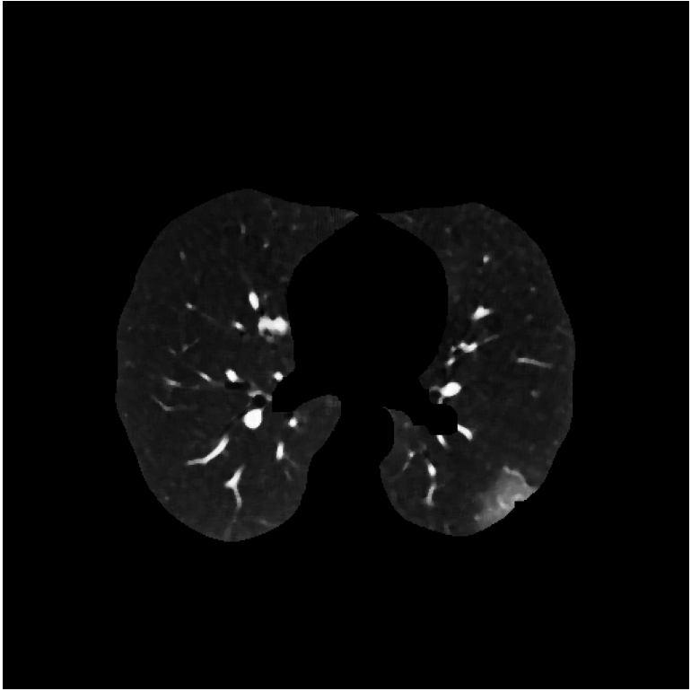
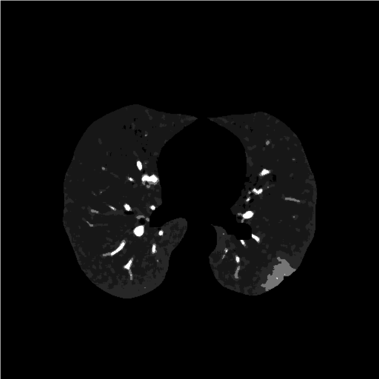

# labeling

This script allow to segment an image once you know the centroids.
By using *sklearn.clustering.KMeans* this script will assign at each pixel the label such that the distance between the label centroid and the pixel GL is minimum. Notice that this script doesn't compute the centroids but only segment an image by using pre-existing ones.


<p style="text-align:center;">
  <caption>Input image</caption>
  <caption>Segmented image</caption>

# Usage

To use this script call it from powershell or bash and provide the required arguments.

```
python -m pipeline.lungselection --input='path/to/image/to/segment/filename.pkl.npy'
--centroids='path/to/centroids/file/centroids.pkl.npy'
--output='path/to/output/folder/outputname'
```
 All the input files must be in *.pkl.npy* format, such as the output one.

Required parameters:

* *--input* :str, path to input image or stack. the file must be in *.pkl.npy* format
* *--output* :str, path to the output folder, here we be saved the lung mask in *pkl.npy* format
