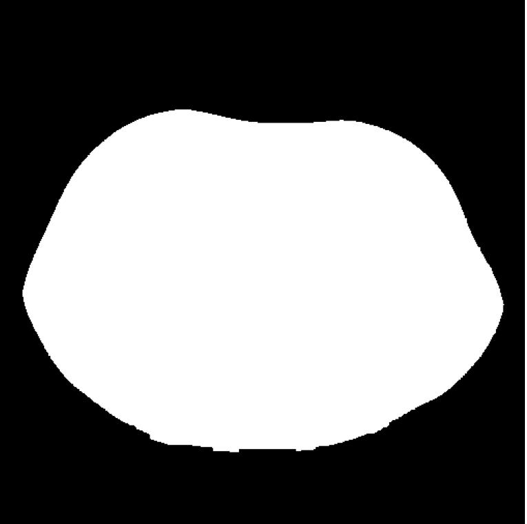

# Lung Selection
This script allows to create a mask for the lung and isolate them.
It takes as input the stack of images and performs the following operations :

* rescaling, to enhance contrast
* preliminary threshold followed by a connected components algorithm, filling operation and an two erosion to isolate the body from the environment and remove the hospital bed.
* second threshold followed by an hole filling and a dilation to isolates the lung from the rest of the body.

At the end of the execution the script save the lung and body mask as '.pkl.npy' in the output directory.


<p style="text-align:center;">
  <caption>Rescaled image</caption>
  <caption>Body mask</caption>
  <caption>Lung mask</caption>

## Usage

To use this script call it from powershell or bash and provide the required arguments.

```
python -m pipeline.lungselection --input='path/to/input/folder/filename.pkl.npy' --lung='path/to/output/folder/outputname'
```

Required arguments:

* --input :str, path to input image or stack. the file must be in '.pkl.npy' format
* --lung :str, path to the output folder, here we be saved the lung mask in -pkl.npy format

The optional arguments:
* --body :str, path to output filename, if provided save the stack of body mask
* --body_thr :float in [0,1), threshold value for the body threshold, default = 0.1
* --lung_thr :float in [0,1), threshold value for the lung selection, default= 0.2
* --min_hole_area : int, minimum area allowed for spot in the images, default = 10
* --k_erosion: int: int, kernel size for the erosions, default 20
* --k_dilation: int, dilation kernel size, default = 5
