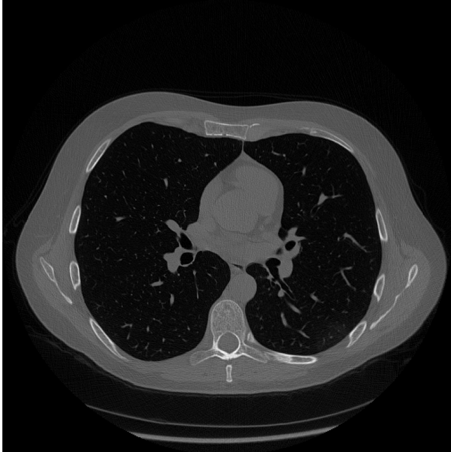
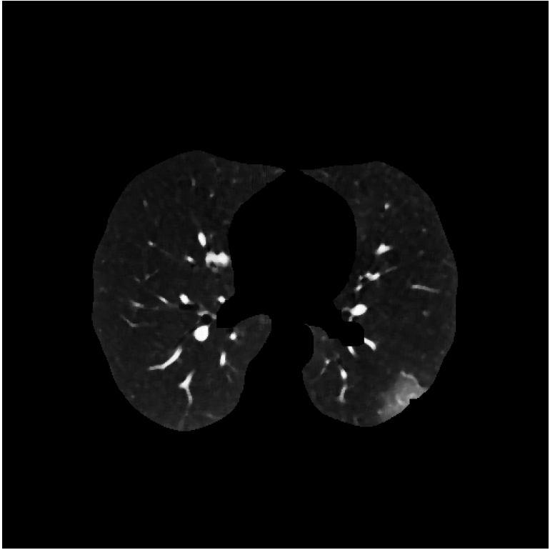

# medianBlur

This script allows to apply a median blurring on a stack of images, and rescale the ray value.
Requires as input the path to the stack of images to process, it also allow to apply a mask on the whole stack. After the blurring, the algorithm apply an erosion in order to erode away the boundaries of regions of foreground pixels.
This script will save the results in the specified output path.

<p style="text-align:center;">
  <caption>Input image</caption>
  <caption>input mask</caption>
  <caption>blurred image</caption>

## Usage

To use this script call it from powershell or bash and provide the required arguments.

```
python -m pipeline.medianBlur --input='path/to/input/folder/filename.pkl.npy' --output='path/to/output/folder/output_name'
```

* --input :str, path to input image or stack. the file must be in '.pkl.npy' format
* --output :str, path to the output folder, here we be saved the lung mask in -pkl.npy format

The optional arguments:

* --mask :str, path to the file that contains a mask to apply to the image
* --blur_ksize :int, size of the blurring kernel, must be an odd number
* --kernel_size :int, size of erosion kernel, must be an odd number
