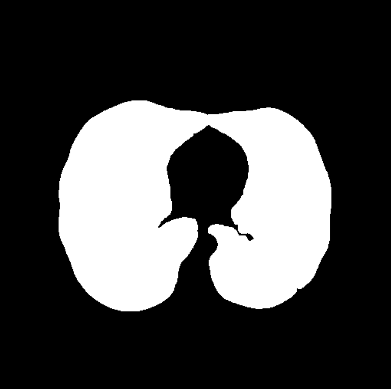
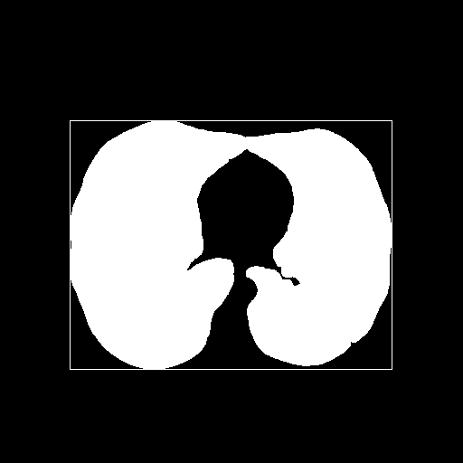

# slice_and_ROI
This script allow to find the rectangular region with the smallest area which still contains the lung. It requires as input the path to the lung mask and save as output an np.ndarray which contains the top left and bottom right corner of the ROI. To find the ROI this script will use the stats provided by
`cv2.connectedComponentsWithStats` function. Refers to `opencv-python` for more details.

<p style="text-align:center;">
  <caption>Input image</caption>
  
  <caption>Draw of the selected ROI</caption>


## Usage

To use this script call it from powershell or bash and provide the required arguments.

```
python -m pipeline.slice_and_ROI --input='path/to/input/folder/filename.pkl.npy' --output='path/to/output/folder/output_name'
```

Required arguments:

* --input :str, path to the input file, we suggested to use a mask file
* --output :str, path to the output file in which data are stored
