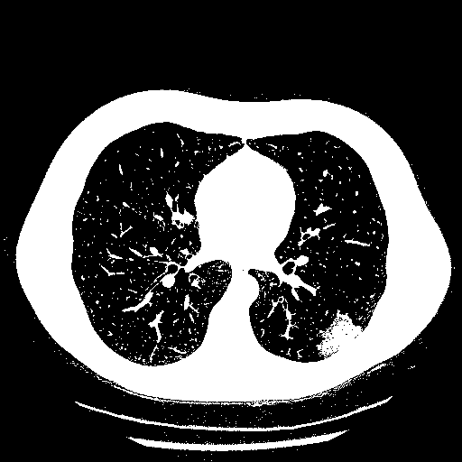
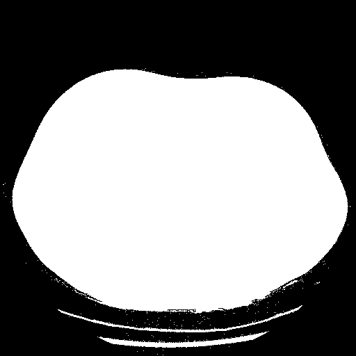
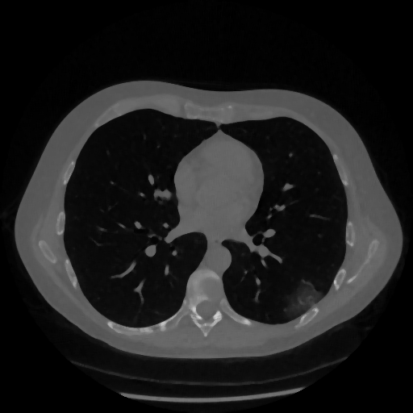

# Method

This module contains functions useful for the script execution. This functions extend some open-cv functions  and allow to perform operations on a stack of images.


1. [erode](#erode)
2. [dilate](#dilate)
3. [connectedComponentsWithStats](#connectedComponentsWithStats)
4. [bitwise_not](#bitwise_not)
5. [imfill](#imfill)
6. [medianBlur](#medianBlur)
7. [otsu](#otsu)
8. [find_ROI](#corner_finder)
9. [remove_spots](#remove_spots)


## erode
Compute the erosion for the whole stack of images. It is the extension for a stack of images of   `cv2.erode()`.

**Parameters**

*img* : array-like, image or stack of images to erode
*kernel* : (2D)array-like, kernel to apply to the input stack
*iterations* : int, number of iterations to apply, default 1

**Return**

*processed* : array-like, eroded stack

```python
  import cv2
  import numpy as np
  from segmentation.utils import load_pickle, save_pickle
  from segmentation.utils import rescale
  from segmentation.method import erode

  stack = load_pikle('./images/image.pkl.npy')
  stack[stack < 0] = 0
  stack = rescale(stack, stack.max(), 0)# apply a rescaling
  stack = 255 * np.where(stack > 0.1, 0, 1)#apply a threshold
  kernel = np.ones((3,3), dtype='uint8') #erosion kernel
  eroded = erode(stack, kernel, iterations=1)
  save_pickle('./output_dir/output_filename',  eroded)
```
<p style="text-align:center;">
  <caption>Thresholded image</caption>
  
  <caption>Eroded image</caption>

## dilate
Compute the dilation for the whole stack of images. It is the extension for a stack of images of   `cv2.dilate()`.

**Parameters**

*img* : array-like, image or stack of images to dilate
*kernel* : (2D)array-like, kernel to apply to the input stack
*iterations* : int, number of iterations to apply, default 1

**Return**

*processed* : array-like, dilated stack


```python
  import cv2
  import numpy as np
  from segmentation.utils import load_pickle, save_pickle
  from segmentation.utils import rescale
  from segmentation.method import dilate

  stack = load_pikle('./images/image.pkl.npy')
  stack[stack < 0] = 0
  stack = rescale(stack, stack.max(), 0)# apply a rescaling
  stack = 255 * np.where(stack > 0.1, 0, 1)#apply a threshold
  kernel = np.ones((3,3), dtype='uint8') #dilation kernel
  dilated = dilate(stack, kernel, iterations=1)
  save_pickle('./output_dir/output_filename',  dilated)
```
<p style="text-align:center;">
  <caption>Original image</caption>
  
  <caption>Dilated image</caption>

## connectedComponentsWithStats

computes the connected components labeled image of boolean image and also
produces a statistics output for each label. Is the extension for a stack of images of `cv2.connectedComponentsWithStats()` function.

**Parameters**

*img* : array-like, input image or stack of images

**Return**

*retval* : array-like

*labels* : array-like, labelled image or stack

*stats* : list of array-like, statistic for each label for each image of the stack

*centroids* : array-like, centroid for each label for each image of the stack


```python
  import cv2
  import numpy as np
  from segmentation.utils import load_pickle
  from segmentation.method import connectedComponentsWithStats

  stack = load_pikle('./images/image.pkl.npy')
  stack= np.where(stack < 3, 0, 1) #apply a threshold to obtain boolean images
  ret, label, stats, centroids = connectedComponentsWithStats(stack)
```


## bitwise_not

Calculates per-element bit-wise inversion of the input stack of images

**Parameters**

*img* : array_like, image or stack of images to invert

**Returns**

*dst* : array-like, inverted image or stack of images


```python
  import cv2
  import numpy as np
  from segmentation.utils import load_pickle, save_pickle
  from segmentation.method import bitwise_not

  stack = load_pikle('./images/image.pkl.npy')
  stack = np.where(stack < 3, 0, 1) #apply a threshold to obtain boolean images
  inverted = bitwise_not(stack)
  save_pickle('./output_filename', inverted)
```
<p style="text-align:center;">
  <caption>Thresholded image</caption>
  
  <caption>Inverted image</caption>

## imfill

This function, based on `cv2.floodFill()` function, is useful to fill holes in the whole stack of images. Note that the input stack must be binary

**Parameter**

*img* : array-like, binary image to fill

**Return**

*filled* : array-like, binary image or stack with filled holes


```python
  import cv2
  import numpy as np
  from segmentation.utils import load_pickle, save_pickle
  from segmentation.utils import rescale
  from segmentation.method import imfill

  stack = load_pikle('./images/image.pkl.npy')
  stack[stack < 0] = 0
  stack = rescale(stack, stack.max(), 0)# apply a rescaling
  stack = 255 * np.where(stack > 0.1, 0, 1)#apply a threshold
  filled = imfill(stack)

  save_pickle('./output_filename', filled)
```
<p style="text-align:center;">
  <caption>image after threshold</caption>
  
  <caption>Filled image</caption>

## medianBlur

Apply a median blur filter on the whole stack of images

**Parameters**

*img* : array-like, image or stack of images to filter

*k_size* : int, aperture linear size; it must be odd and greater than 1

**Return**

*blurred* : array-like, median blurred image or stack


```python
  import cv2
  import numpy as np
  from segmentation.utils import load_pickle, save_pickle
  from segmentation.utils import rescale
  from segmentation.method import medianBlur

  stack = load_pikle('./images/image.pkl.npy')
  stack[stack < 0] = 0
  stack = rescale(stack, stack.max(), 0)
  blurred = medianBlur(stack, 5)
  save_pickle('./output_filename', blurred)
```
<p style="text-align:center;">
  <caption>rescaled image</caption>
  
  <caption>blurred image</caption>


## otsu

Compute the best threshld value for each slice of the input image stack by using otsu algorithm

**Parameters**

*img*: array-like
    input image or stack of images. must be uint8 type

**Return**

*out*: array-like
    threshlded image stack

```python
  import cv2
  import numpy as np
  from segmentation.utils import load_pickle, save_pickle
  from segmentation.utils import rescale
  from segmentation.method import otsu

  stack = load_pikle('./images/image.pkl.npy')
  stack[stack < 0] = 0
  stack = rescale(stack, stack.max(), 0)
  stack = (255 * stack).astype(np.uint8)
  thr = otsu(stack)
  save_pickle('./output_filename', thr)
```

<p style="text-align:center;">
  <caption>input image</caption>
  
  <caption>thresholded image</caption>


## find_ROI

Found the upper and lower corner of the smallest rectangle that still contains the lung regions for each image of the input stack

**Parameter**

*stats*: pandas dataframe
    dataframe that contains the stats of the connected regions. columns must be ...

**Return**

*corners*: array-like
    array which contains the coordinates of the upper and lower corner of the ROI organized as [x_top, y_top, x_bottom, y_bottom]


## remove_spots

Set to zero the GL of all the connected region with area lesser than area

**Parameters**

*img*: array-like
    binary image from which remove spots

*area*: int
    maximun area in pixels of the removed spots

**Return**

*filled*: array-like
    binary image with spot removed

```python

from segmentation.utils import load_pickle, save_pickle
from segmentation.utils import preprocess
from segmentation.method import remove_spots
from segmentation.method import otsu

#load the image
img = load_pikle('./images/image.pkl.npy')
img = preprocess(img)

#apply a threshold
img = otsu(img)
#fill the smallest holes
filled = remove_spots(img, 500)
save_pickle('./images/filled.pkl.npy')
```
