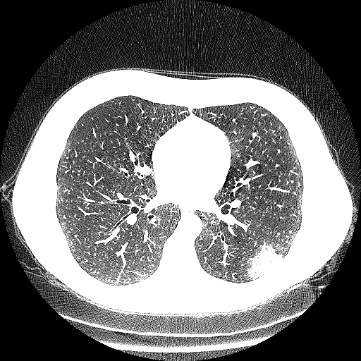

# utils

This modules contains useful functions to mange input and output image stacks and simple operations on single images

1. [load_pickle](#load_pikle)
2. [load_npz](#load_npz)
3. [save_pickle](#save_pikle)
4. [save_npz](#save_npz)
5. [rescale](#rescale)
6. [preprocess](#preprocess)


## load_pikle

This function load the '.pkl.npy' file that contains the image or the stack of images to process

**Parameter**

*filename*: str, file name or path to load file as pickle

**Return**

*data*: array like, numpy nd.array that contains the stack of images-

  ```python
    import cv2
    import numpy as np
    from segmentation.utils import load_pickle

    stack = load_pikle('./images/image.pkl.npy')
    #
    #Processing
    #
  ```

## load_npz

This function load the '.npz' file that contains the image or the stack of images to process

**Parameter**

*filename*: str, file name or path to load file as pickle

**Return**

*data*: array like, numpy nd.array that contains the stack of images-

  ```python
    import cv2
    import numpy as np
    from segmentation.utils import load_npz

    stack = load_npz('./images/image.npz')
    #
    #Processing
    #
  ```

## save_pikle

Save in the processed stack of images '.pkl.npy' format. Data must be in a np.ndarray like format and the specified output file name doesn't requires to specify the extension.  

**Parameters**

*filename*: str, file name or path to dump as pickle file

*data*: array-like, image or stack to save
**Return** None

```python
import cv2
import numpy as np
from segmentation.utils import load_pickle, save_pickle

stack = load_pikle('./images/image.pkl.npy')
#
#Stack processing
#
save_pickle('./output_dir/output_filename', stack)
```


## save_npz

Save in the processed stack of images '.pkl.npy' format. Data must be in a np.ndarray like format and the specified output file name doesn't requires to specify the extension.  

**Parameters**

*filename*: str, file name or path to dump as pickle file

*data*: array-like, image or stack to save
**Return** None

```python
import cv2
import numpy as np
from segmentation.utils import load_npz, save_npz

stack = load_pikle('./images/image.pkl.npy')
#
#Stack processing
#
save_pickle('./output_dir/output_filename', stack)
```


## rescale

Rescale the image according to max, min input

**Parameters**

  *img* : array-like, input image or stack to rescale
  *max* : float, maximum value of the output array
  *min* : float, minimum value of the output array

  **Return**

  *rescaled* : array-like, image rescaled according to min, max

  ```python
    import cv2
    import numpy as np
    from segmentation.utils import load_pickle, save_pickle
    from segmentation.utils import rescale

    stack = load_pikle('./images/image.pkl.npy')
    rescaled = rescale(stack, stack.max(), 0)
    save_pickle('./output_dir/output_filename',  rescaled)
  ```


## preprocess

Set to zero all the negative pixel values, rescale the image and convert it a 8bit GL image.

**Parameter**

*img*: array-like
    input image or stack of images

**Return**
------
*out*: array like
    rescaled image

```python
  import cv2
  import numpy as np
  from segmentation.utils import load_pickle, save_pickle
  from segmentation.utils import preprocess

  stack = load_pikle('./images/image.pkl.npy')
  stack = preprocess(stack)
  save_pickle('./output_dir/output_filename',  stack)
```


  <p style="text-align:center;">
    <caption>Original image</caption>
    
    <caption>preprocessed image</caption>
