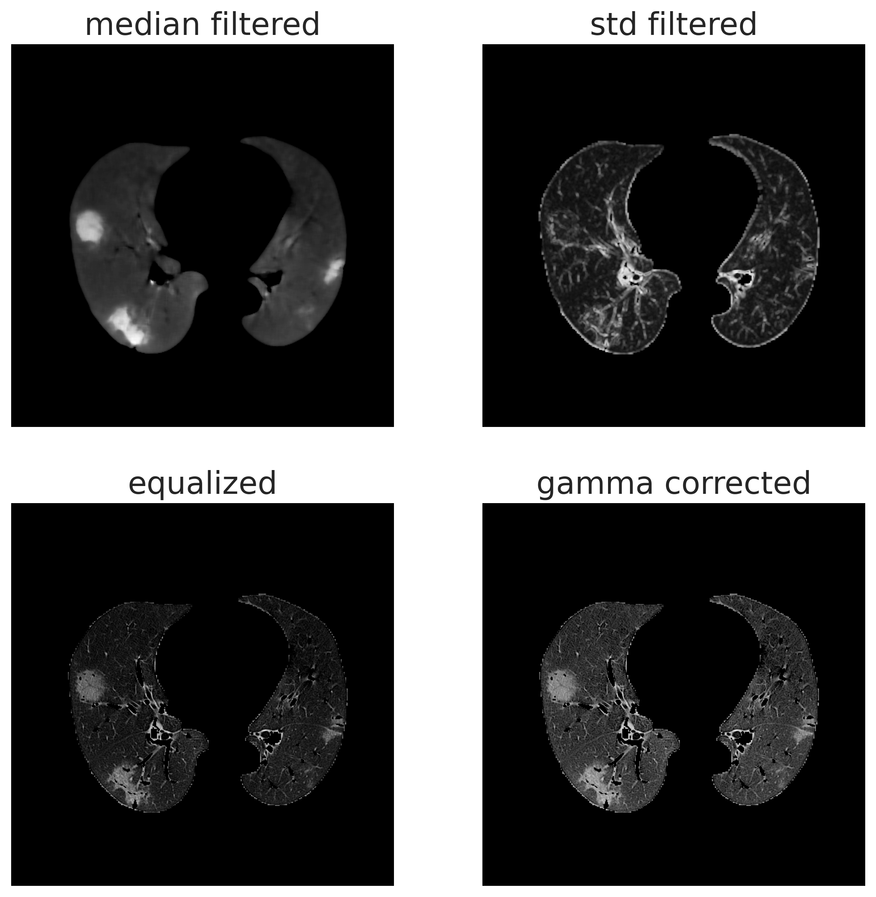

COVID-19 Lung Segmentation
==========================

The SARS-CoV-2 virus has widely spread all over the world since the beginning of 2020.
This virus affects lung areas and causes respiratory illness. In this scenario is
highly desirable a method to identify in CT images the lung injuries caused by COVID-19.
The approach proposed here is based on colour quantization to identify the infection
regions inside the lung(Ground Glass Opacities, Consolidation and Pleural Effusion).

To achieve this purpose we have used the colour quantization approach to segment the
chest CT scans of patients affected by COVID-19. Use this technique as medical
image segmentation means to reduce the number of colours in the image to the number
of anatomical structures and tissue present in the anatomical region; in this
way we  assign to each kind of tissue a characteristic colour: so must exist a
relationship between the kind of tissue and the colour used to represent it.

For CT scan which is in greyscale, each colour is represented by a single value
given by the Hounsfield Units(HU): voxels colours are proportional to HU, which
are defined as a linear transformation of the linear attenuation coefficient.
HU normalize the coefficient of a particular tissue according to a reference one,
usually, water, as we can see in the equation below :

.. math::

  	HU = 1000\times\frac{\mu - \mu_{H_2 O}}{\mu_{H_2 O}}

In the end, each colour results proportional to the linear attenuation coefficient,
different from each tissue, so exist a relation between the GL and the tissue type
that makes these techniques available.

Colour quantization and the properties of digital images allow us to consider also
other properties of the image beside the single voxel intensity.
This purpose can be achieved by building a suitable colour space:

In digital image processing, images are represented with a 3D tensor, in which the
first two dimensions represent the height and width of the image and the last one
the number of channels. Grayscale images require only one channel, so each pixel
has a numeric value whose range may change according to the image format.
On the other hand colour images requires 3 channels, and the value of each channel
represent the level of the primary colour stored in this particular channel, so each
colour is represented by 3 different values, according to the Young model.
In this work, the different channels are used to takes into account different properties,
exploited by the application of different filters. This allows us to consider also
neighbouring voxels, which is really suitable for the segmentation since the
lesions areas involve many closest voxels, not only a single one. We have also
used these features to discriminate between other lung regions like bronchi by
exploit shape information.
The used image features are displayed in the figure below:

Once we have built the colour space, we have to found the characteristic colour of
each tissue under study, which is represented by centroids in the colour space.
To perform this task and achieve the centroids estimation a simple -means
clustering was used.
K-means clustering requires prior knowledge about the number of clusters, which
in our case is given by the anatomical structure of the lung, so we can consider
a different cluster for each anatomical structure.
Once we have estimated the centroids for each tissue, we use that for the actual
segmentation by assign each voxel to the cluster of the closest centroids: in this
way the estimation step, that we will call "train", needs to be performed only once,
so can be time expansive since is not involved in the actual segmentation.

This package provides a set of already estimates centroids, together with scripts
to perform the actual segmentation. Also, a script to train your own set of centroids
is provided.
